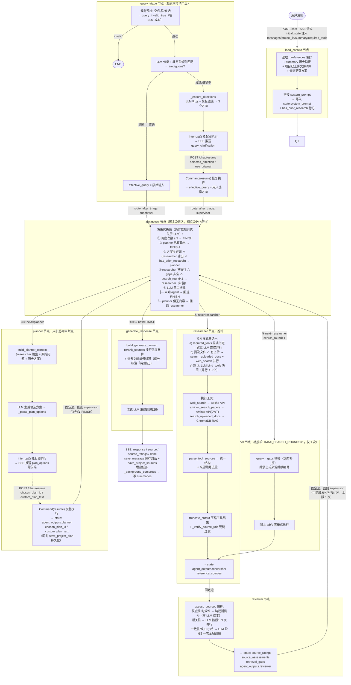

# Research Assistant Agent

多智能体科研助手：基于 LangGraph Supervisor 编排架构，集成文献检索（Web / AMiner / 上传文档 RAG）、来源评审、研究方案人机协同设计、报告生成。

## 系统工作流编排图

## 图说明

- **入口**：`POST /chat`，SSE 流式返回；`query_triage` 与 `planner` 两个节点会通过 `interrupt()` 挂起，经 `POST /chat/resume` 恢复。
- **调度核心**：`supervisor` 可被多次进入，调度次数上限 5；确定性规则（关键词、缺口补搜）优先于 LLM 决策。
- **补搜闭环**：reviewer 产出信息缺口后，supervisor 最多触发 1 次定向补搜（`MAX_SEARCH_ROUNDS=1`）。
- **人机协同**：模糊提问在 `query_triage` 澄清方向，方案设计在 `planner` 让用户选方案/自定义，均通过 interrupt/resume 实现。
- **技术栈**：LangGraph（Supervisor 编排）+ FastAPI（SSE）+ DeepSeek LLM + ChromaDB RAG + SQLite（消息/摘要/方案持久化 + LangGraph checkpoint）。
